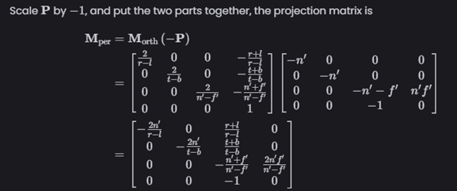
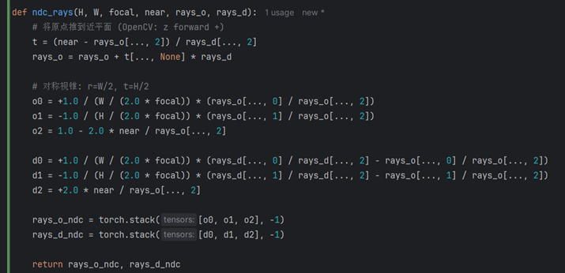

# Nerf
Dataset link: https://drive.google.com/file/d/1-qw4NMKZeOAAEAYfHSq7cwCtIxlEU8hl/view?usp=drive_link
## 参考文献
https://github.com/yenchenlin/nerf-pytorch/tree/master  代码基础（重要）  
https://www.scratchapixel.com/lessons/3d-basic-rendering/volume-rendering-for-developers/intro-volume-rendering.html  图形学相关知识 （重要）   
https://zhuanlan.zhihu.com/p/576416530  如何运行原代码  
https://zhuanlan.zhihu.com/p/598464999  Nerf源码解读  
https://yconquesty.github.io/blog/ml/nerf/  图形学角度的Nerf解读（重要）  
https://arxiv.org/pdf/2209.02417  Nerf作者的推导（重要）  
https://zhuanlan.zhihu.com/p/593204605/ Nerf坐标系解读（重要）  
https://arxiv.org/pdf/2003.08934 Nerf原始论文（重要） 
https://zhuanlan.zhihu.com/p/595117334 Nerf体渲染公式推导（重要）  

## 本项目目的
学习Nerf流程  
实现Nerf基于奥比中光RGBD模组  
改为全程使用OpenCV坐标系，不再使用其他坐标系。一方面验证自己的Nerf理解，一方面和SLAM程序对齐。  

## 背景
Novel view synthesis指的是对一个场景给定一些input images时，如何获取其他view的视图   
有两种：一个是显式三维重建，然后就自然获取了其他view，还一个是不再显式三维重建，直接利用volume rendering来获取新view的每个像素的RGB值，volume render就是模拟光线穿过体数据的采样和累积过程。

T(t)是累积透射率，σ是该点的volume density, c是color，r(t)=o+td，o是光线原点，d是光线方向
具体以上公式怎么来的，参考下面volume render的链接，非常庞大的章节

Volume Render:  
https://www.scratchapixel.com/lessons/3d-basic-rendering/volume-rendering-for-developers/intro-volume-rendering.html  
https://arxiv.org/pdf/2209.02417    
https://zhuanlan.zhihu.com/p/595117334    
  
积分肯定是无法直接使用的，必须离散化。把整条光路[0, s]（也就是t_near, t_far），划分为N个等距的区间，区间内的  
$$
I(t_n \to t_{n+1}) = \int_{t_n}^{t_{n+1}} T(t)\sigma_n C_n \, dt 
= \sigma_n C_n \int_{t_n}^{t_{n+1}} T(t) \, dt
$$

其中

$$
T(t) = \exp\!\left(-\int_{0}^{t} \sigma(u)\,du \right),
$$

这里是0到t的积分，为了去掉tn前的积分，将T(t)写为

$$
T(t) = \exp\!\left(-\Bigg[\int_{0}^{t_n} \sigma(u)\,du + \int_{t_n}^{t} \sigma(u)\,du \Bigg]\right)
= T(0 \to t_n)\, T(t_n \to t)
$$ 

也就得到

$$
I(t_n \to t_{n+1})
= \sigma_n C_n T(0 \to t_n) \int_{t_n}^{t_{n+1}} T(t_n \to t)\, dt
$$

$$
= \sigma_n C_n T(0 \to t_n) \int_{t_n}^{t_{n+1}} 
\exp\!\big(-\sigma_n u|_{t_n}^{t} \big)\, dt, 这一段\sigma_n与u无关
$$

假设  $v = t - t_n,  dv = dt$ 积分上下限为$ v= 0 \to (t_{n+1} - t_n) $，于是：

$$
I(t_n \to t_{n+1})
= \sigma_n C_n T(0 \to t_n) \int_{0}^{\Delta t}
\exp(-\sigma_n v)\, dv
$$

$$
= \sigma_n C_n T(0 \to t_n) \left[\frac{\exp(-\sigma_n v)}{-\sigma_n}\right]_{0}^{\Delta t}
$$

$$
= C_n T(0 \to t_n) \left(1 - \exp\!\big(-\sigma_n (t_{n+1} - t_n)\big)\right)
$$

代入回总的公式
$$
I(s) = \int_{0}^{s} T(t)\,\sigma(t)\,C(t)\,dt \;+\; T(s)I_0
$$

$$
\approx \sum_{n=1}^{N} I(t_n \to t_{n+1}) \;+\; T(s)I_0
$$

$$
= \sum_{n=1}^{N} C_n T(0 \to t_n) \big(1 - \exp(-\sigma_n (t_{n+1} - t_n))\big) + T(s) I_0
$$

对 T(0->tn) 也离散化，得到

$$
T_n = \exp\!\left(- \int_{0}^{t_n} \sigma(u)\,du \right)
\;\approx\; \exp\!\left(- \sum_{k=1}^{n-1} \sigma_k \delta_k \right), 
\quad \delta_k \text{ 就是区间长度}
$$

最终

$$
I(s) = \sum_{n=1}^{N} C_n T(n) \big(1 - \exp(-\sigma_n (t_{n+1} - t_n))\big) + T(s) I_0
$$

对比Nerf论文的公式  

## 训练流程
通俗讲，就是训练一个模型，它的输入是一个射线（direction方向上的采样点xyz+direction方向），输出该采样点的rgb和volume density，一旦有了这条射线上的所有采样点的RGB和volume density，我们就可以根据上面提到volume render方程来计算在图像上，该点的RGB值。

## 数据准备
Colmap：feature extraction，feature matching，start reconstruction   
使用统一相机内参，FULL OPENCV，禁止相机内参参与BA优化   
  
参考nerf_prepare_dataset.py  

## load_llff_data
rescale bds  
归一化poses，把所有poses的均值放在世界原点，包括translate和rotation  
计算render poses，和训练无关，只是为了test的时候出mp4看结果  

## get_embedder
为什么需要positional encoding。原论文论述了这一点，deep network通常会biased学习到low frequency的部分，但实际的nerf新视角重建需要network学习到高频部分，一个有效的做法是利用high frequency functions把inputs映射到高维空间去，让network学习高频的变化。  

## Nerf
   
模型输入为x: 3D点的高维表示，d: 视角的高维表示  
模型输出为σ体素的密度volum density, RGB预测的颜色  

## get_rays_np
原始实现只有简单的raytrace过程，这里我实现了带畸变的raytrace过程，因为大多数实际相机都有畸变，这里不采用先对图像进行去畸变的操作，也就是保持RGB原图
    

## ndc_rays  
https://yconquesty.github.io/blog/ml/nerf/nerf_ndc.html  
将给定的rays_o和rays_d转换到归一化的NDC空间中  
首先跟着推文，按原始的OPENGL坐标系推导，随后换到opencv坐标系下
    
上面透视变换矩阵，把相机坐标系下的点xyz（原本是透视变换）映射到了一个正交体  
上面透视变换矩阵怎么来的？首先第四行是为了要求后续做齐次除法时，分母时原来的z  
点落在z=-near平面上，做完齐次除法后的xy要与之前xy相同  
$$
x^`=(n^` x)/z,y^`=(n^` y)/z
$$

假设矩阵第三行为 $$ [0,0,\gamma,\delta]$$，则有

$$
(x', y', z', w')^T = (n x, n y, \gamma z + \delta, z)^T
$$

也就是

$$
z' = \frac{\gamma z + \delta}{z}
$$

为了把透视视锥变成平行六面体，代入 $$z = -\text{near} 和 \text{far}$$

$$
\gamma + \frac{\delta}{-n^`} = -n^`, 
\quad
\gamma + \frac{\delta}{-f^`} = -f^`
$$

解得：

$$
\gamma = n^` + f^`, 
\quad 
\delta = -n^` f^`
$$

   
最右边一项：corner to origin, 平移，使得l，b，n对齐原点  
中间一项：缩放到2x2x2的cube  
最左边一项：平移成[-1,1]的cube上  

   
注意P是Homogeneous的，乘以-1不影响P的效果，因为Nerf的camera看向z的负向  
由于camera frustum都是对称的，则有l=-r, b=-t  

  
于是，当我们有一个点xyz1，和对应的ray: r=o+td在world space下（世界坐标系），我们的NDC投影可以得到，注意这里的t是top，不是ray的t  

  
如何在NDC下表示ray？  
  
  

为什么需要NDC？因为图像的像素中无限depth完全有可能出现，映射到[0,1]NDC空间变成了有界cube    
对于实际的camera而言，near就是focal length，far就是无穷大，r和t就是W/2，H/2

  
额外的细节，Nerf把ray的起始o点直接放到了near平面上，因为实际采样点只会出现在near平面之后，一旦把world space下的ray转换到NDC下，就可以对t`从0到1进行采样方便。注意这里压缩到NDC空间的是[near, far]这个视锥体，对应的就是[focal, inf]这个区间。   
NDC是OPENGL坐标系，也即y向上，x向右，z沿着camera向外，为了转换到opencv坐标系，设S=diag(1,-1,-1,1)

$$
M_{\text{per, opencv}} =
\begin{bmatrix}
\dfrac{n}{r} & 0 & 0 & 0 \\[6pt]
0 & -\dfrac{n}{t} & 0 & 0 \\[6pt]
0 & 0 & \dfrac{f+n}{f-n} & -\dfrac{2fn}{f-n} \\[6pt]
0 & 0 & 1 & 0
\end{bmatrix}
$$

简单验证下，当z=n时，z_ndc=-1, 当z=f时，z_ndc=1  

$$
M_{\text{per,opencv}}
\begin{bmatrix}
x \\ y \\ z \\ 1
\end{bmatrix}
=
\begin{bmatrix}
\dfrac{n}{r}x \\[6pt]
-\dfrac{n}{t}y \\[6pt]
\dfrac{f+n}{f-n}z - \dfrac{2fn}{f-n} \\[6pt]
z
\end{bmatrix}
$$

投影结果：

$$
\text{project} \;\to\;
\left(
\dfrac{n}{r}\dfrac{x}{z},\;
-\dfrac{n}{t}\dfrac{y}{z},\;
\dfrac{f+n}{f-n} - \dfrac{2fn}{(f-n)z}
\right)
$$

当然n=f_cam, f=inf, r=W/2, t=H/2时   

$$
O = \left(
\dfrac{f_{\text{cam}}}{W/2}\dfrac{x}{z},\;
-\dfrac{f_{\text{cam}}}{H/2}\dfrac{y}{z},\;
1 - \dfrac{2n}{z}
\right)
$$

$$
d = \left(
\dfrac{f_{\text{cam}}}{W/2},\;
-\dfrac{f_{\text{cam}}}{H/2},\;
\cdots,\;
2n,\;
\cdots
\right),
\quad \text{也可以对应推出}
$$

最终opencv坐标系的ndc ray实现参考实际代码   
   

## 实际渲染render_rays
https://yconquesty.github.io/blog/ml/nerf/nerf_rendering.html
  
$$
z = (1 - t)\, near + t \, far
$$

$$
z = \dfrac{1}{\dfrac{1-t}{near} + \dfrac{t}{far}}
$$

前者在depth上均匀采样，后者在d=1/z（disparity）上均匀采样，这样近处会采样更密集，远处采样会更稀疏。   

  
沿着ray计算采样点（NDC空间下），在每个区间内随机取点

## raw2outputs
通过MLP输出的采样点的rgb和alpha，重新渲染对应图像  
    

求出相邻点的深度差（不是沿着ray，仅z轴方向），同时最后一列增加1e10来表示正无穷   
  
取出MLP输出的RGB值，sigmoid压制到[0,1]，因为网络输出范围负无穷到正无穷
  

这段代码在计算论文以及之前都有提到的C(r)的离散计算公式  

  

首先，给MLP输出的volume density加上noise，
$$ \sigma_i^b = \mathrm{relu}\!\left(\sigma_{\text{raw},i}^b + \mu[0,1]\right) $$

计算代码中的alpha
$$
A_{B \times N_C} = 1_{B \times N_C} - \exp \big( \sigma_{B \times N_C} * \Delta_{B \times N_C} \big)
$$

$$
= \begin{bmatrix}
1 - e^{\sigma_1^1 \delta_1^1} & \cdots & 1 - e^{-\infty} \\
\vdots & \ddots & \vdots \\
1 - e^{\sigma_1^B \delta_1^B} & \cdots & 1 - e^{-\infty}
\end{bmatrix}
$$

计算weights（就是Ti），这里用了cumprod函数，用1-A获得正的exp，然后横向加到一起  

  
  
  
直接hadamard product就计算好了weights  
最后计算深度图（以weights加权），disp=1/depth，acc map（累积的不透明度）

